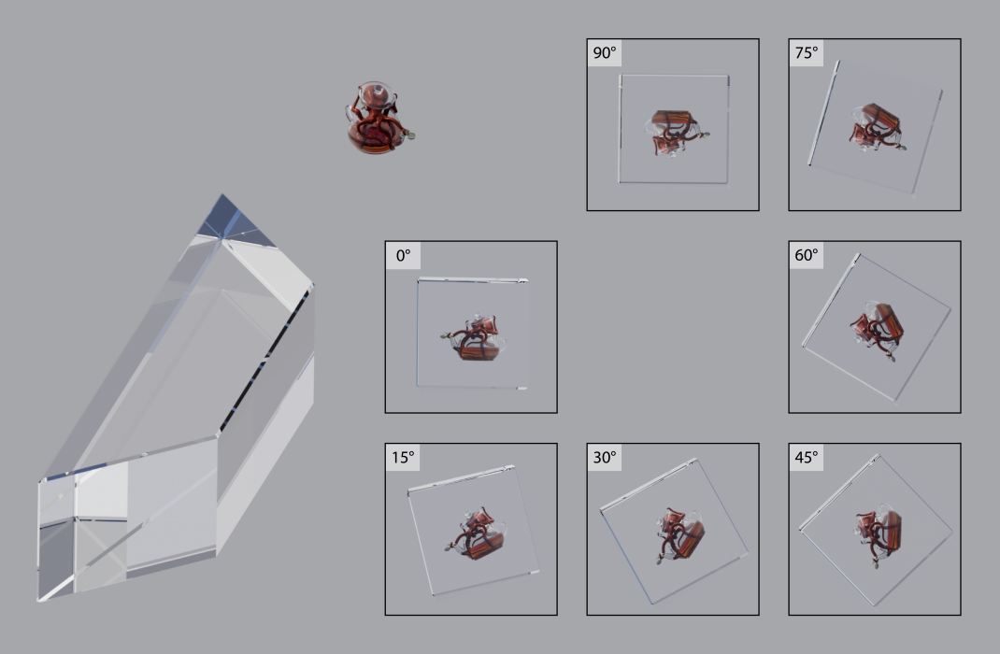
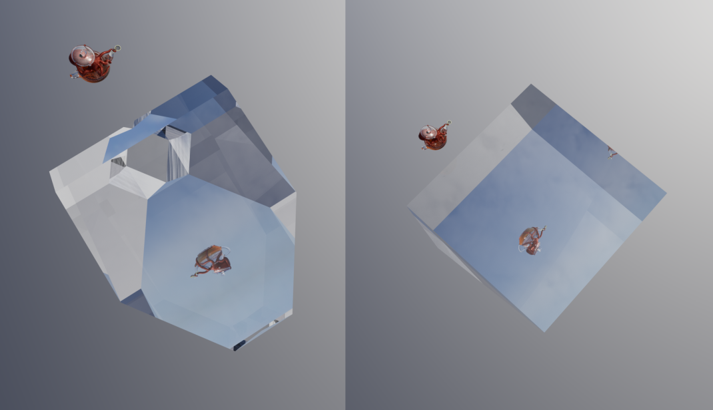
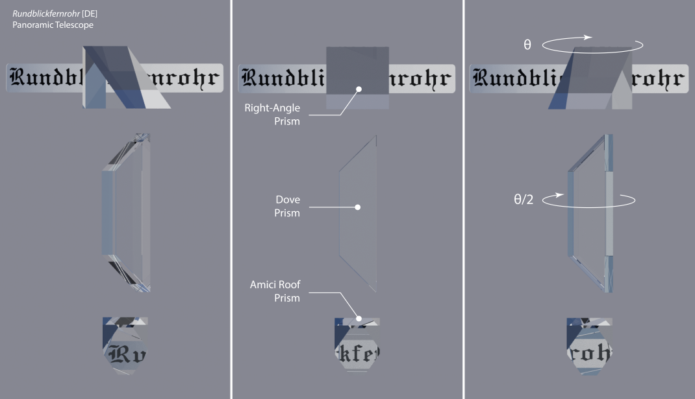

# PBR of Optical Elements with *three-gpu-pathtracer*

The *[three-gpu-pathtracer](https://github.com/gkjohnson/three-gpu-pathtracer)* library
leverages [three-mesh-bvh](https://github.com/gkjohnson/three-mesh-bvh) and WebGL 2 to deliver high-quality, 
physically based rendering (PBR) on the GPU. Key features include support for the GGX surface model, materials information, textures, normal maps, emission, environment maps, tiled rendering. As a result, path tracing also supports reflection and refraction of optical materials!

This GitHub repository demonstrates *three-gpu-pathtracer*'s ability to simulate realistic PBR for optical parts.
The demonstration focuses on three standard optical prisms: the **Dove prism**, the **right-angle prism**, and the **Amici roof prism**. When combined, these prisms form the core optical system of a **panoramic telescope** (or 𝕽𝖚𝖓𝖉𝖇𝖑𝖎𝖈𝖐𝖋𝖊𝖗𝖓𝖗𝖔𝖍𝖗 in German).

### Examples: PBR with Optical Prisms

[Panoramic Telescope](https://cyamahat.github.io/three-gpu-pathtracer-optics/examples/bundle/index.html)

[Dove Prism](https://cyamahat.github.io/three-gpu-pathtracer-optics/examples/bundle/index.html#Dove%20Prism)

[Right-Angle Prism](https://cyamahat.github.io/three-gpu-pathtracer-optics/examples/bundle/index.html#Right-Angle%20Prism)

[Amici Roof Prism](https://cyamahat.github.io/three-gpu-pathtracer-optics/examples/bundle/index.html#Amici%20Roof%20Prism)

---
### PBR Illustrations

***PBR of the Dove prism**. The original GLB file is animated (rotation of the Dove prism).*
 *3D model: [Cartoon octopus takes a tea bath](https://skfb.ly/oqIRG).* 
 
 

 ***Amici Roof Prism vs. Right-Angle Prism**. The image output from a prism is either right-handed or left-handed*
 *(i.e., mirrored), determined by the number of internal reflections within the prism.*
 
 

***Panoramic Telescope**. When the right-angle prism undergoes azimuth rotation by an angle theta (θ),*
 *rotating the Dove prism by half theta (θ/2) ensures the output image remains horizontal.*
